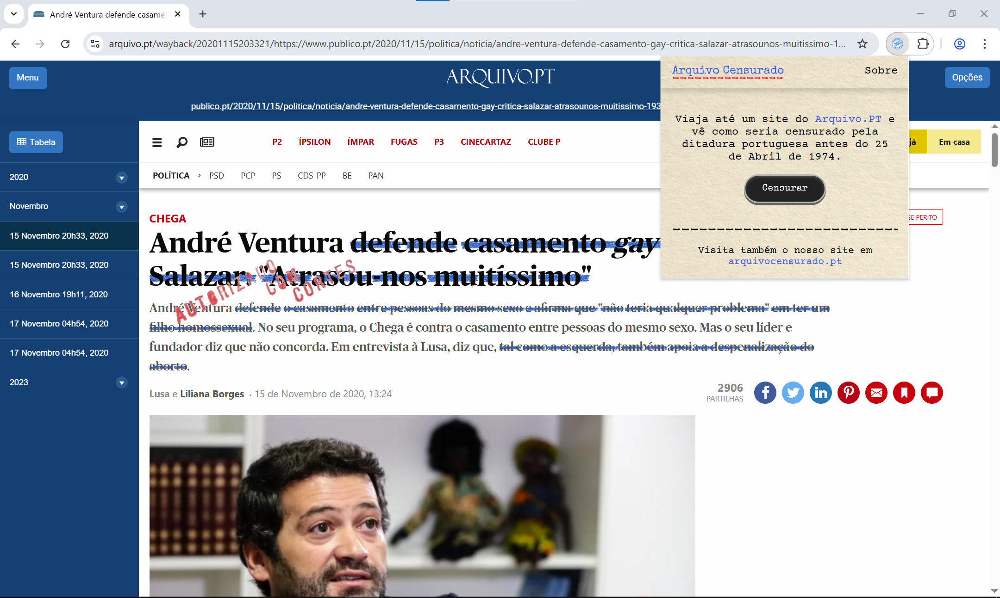
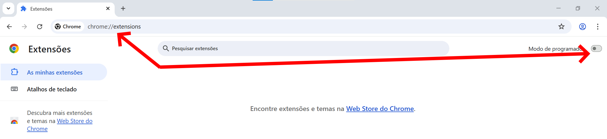
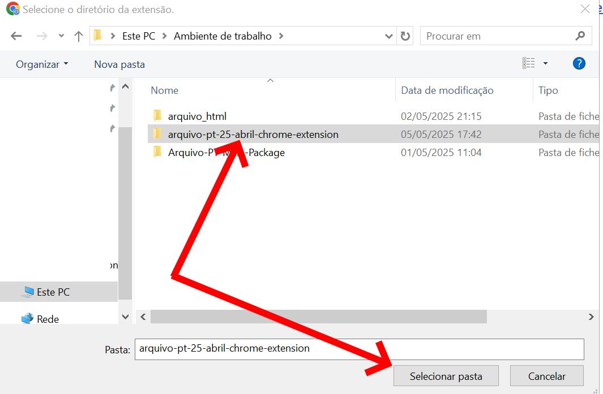
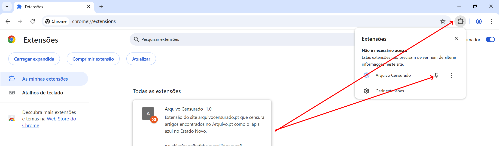
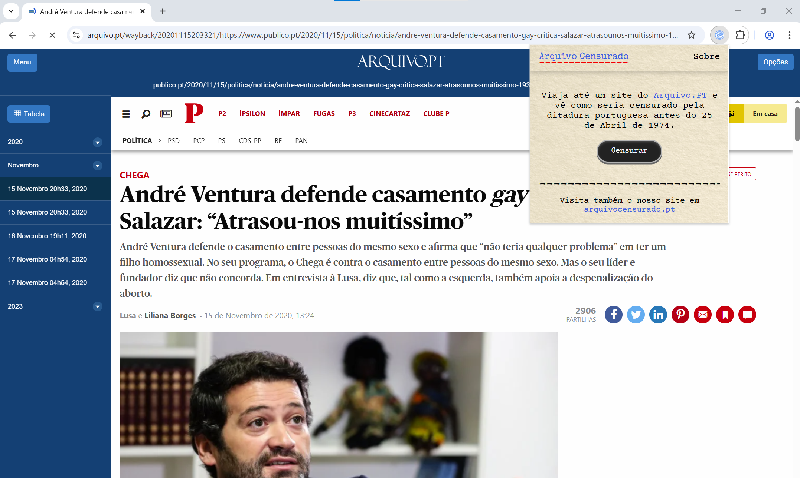
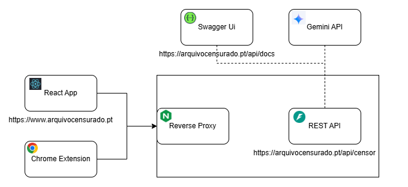

<div style="display: flex; align-items: center; gap: 16px; margin-bottom:1.5rem">
  
  <h1>Arquivo Censurado – Chrome Extension</h1>
</div>

O **Arquivo Censurado** é um projeto de investigação científica que visa estudar a capacidade de censura automática de modelos de linguagem de última geração. Desenvolvido no âmbito da iniciativa “50 anos do 25 de Abril” e inserido no Prémio Arquivo.pt 2025, promovido pela FCT e pelo Arquivo.pt, esta extensão permite censurar em tempo real as páginas do Arquivo.pt sem recorrer a ferramentas externas.

<u>Experimente ver como seriam os conteúdos da web portuguesa se estivesse em 24 de abril de 1974:</u>



---

### Repositório da Componente: Extensão Chrome

Este repositório contém todo o código-fonte da Extensão Chrome do Arquivo Censurado, desenvolvida em JavaScript ES6. O design segue a mesma estética da [aplicação web]() do projeto.

---

## 📦 Estrutura do Projeto

```bash
.
├── docs                   # Imagens usadas neste README
├── imgs
│   ├── test_icon.png      # Ícone temporário da barra de ferramentas
│   └── scribble.png       # Exemplo de sobreposição com traço de giz-de-cera
├── lib
│   ├── events.js          # Gestores de eventos partilhados
│   ├── morph.js           # Utilitários de manipulação do DOM
│   └── index.js           # Método Nanomorph
├── popup
│   ├── popup.html         # Marcações da janela pop-up
│   ├── popup.css          # Estilos da janela pop-up
│   └── popup.js           # Lógica dos botões
├── contentScript.js       # Injecta scripts em páginas arquivo.pt/wayback/*
├── manifest.json          # Manifesto da Extensão Chrome (V3)
├── LICENSE                # Licença do projeto
└── README.md              # Este ficheiro
```

---

## 🚀 Instalação e Utilização

A extensão encontra-se em revisão pela Google e deverá estar brevemente disponível na [Chrome Web Store](). Entretanto, pode instalá-la localmente seguindo estes passos:

1. **Clonar ou Transferir o repositório**

   ```bash
   git clone git@github.com:arubenruben/arquivo-pt-25-abril-chrome-extension.git
   cd arquivo-pt-25-abril-chrome-extension
   ```

2. **Abrir a página de Extensões do Chrome**

   * No Chrome, aceda a `chrome://extensions/`.
   * Ative o **Modo de programador** (canto superior direito).

     

3. **Carregar a Extensão Descompactada**

   * Clique em **Carregar sem compactação**.
   * Seleccione a pasta raiz do projeto (a que contém o `manifest.json`).

     

4. **Fixar a extensão na barra de ferramentas (opcional)**

   * Clique no ícone de puzzle e depois no alfinete junto de “Arquivo Censurado”.

     

5. **Verificar a Instalação**

   * Deverá ver “Arquivo Censurado” na lista de extensões, com o ícone temporário.

     

---

## Arquitetura

A Extensão Chrome comunica com a API do Arquivo Censurado para submeter conteúdo e receber as respostas de censura automática via HTTPS. Por defeito, o endpoint configurado é:

```
https://arquivocensurado.pt/api/censor
```

<div style="display: flex; justify-content: center; margin-top:2rem">
  
</div>

* [Repositório da API do Arquivo Censurado]()

---

## Citação

Se utilizar este projeto em publicações científicas, agradecemos que faça referência à seguinte citação (exemplo):

>Brevemente

---

## Licença

Este software está licenciado sob a **GPL-3.0**, permitindo o uso e modificação para fins académicos e de investigação sem fins lucrativos. Consideramos a censura um tema de interesse público e, por isso, vedamos o uso comercial deste código.
