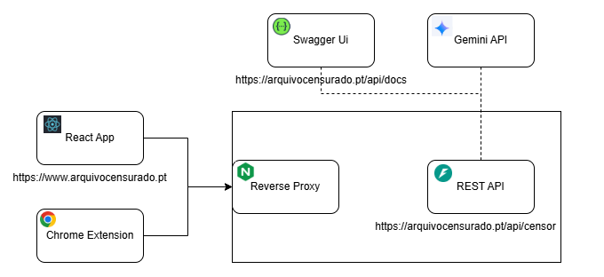

<div style="display: flex; align-items: center; gap: 16px; margin-bottom:1.5rem">
  
  <h1>Arquivo Censurado – Web</h1>
</div>

O **Arquivo Censurado** é um projeto de investigação científica que visa estudar a capacidade de censura automática de modelos de linguagem de última geração. Desenvolvido no âmbito da iniciativa “50 anos do 25 de Abril” e inserido no Prémio Arquivo.pt 2025, promovido pela FCT e pelo Arquivo.pt. 

---

### Repositório da Componente Web

Aqui encontra-se todo o código-fonte da aplicação web do Arquivo Censurado, implementada como uma **Single Page Application (SPA)** em [React 19](https://reactjs.org/) e suportada pelas bibliotecas [MUI (Material-UI) v7](https://mui.com/) e [React-Bootstrap 2](https://react-bootstrap.github.io/).

---

## Arquitetura

<div style="display: flex; justify-content: center; margin-top:2rem">
  
</div>

---

## Estrutura do Repositório

```bash
.
├── public                 # Ficheiros públicos (HTML, manifest, favicon, imagens estáticas)
│   ├── logo512.png
│   └── diagram.png
└── src
    ├── assets             # Recursos estáticos do projeto
    │   ├── css
    │   ├── db
    │   └── img
    ├── components         # Componentes React reutilizáveis
    │   ├── form
    │   ├── navbar
    │   └── spinner
    └── pages              # Páginas (JSX)
        ├── Home.jsx
        ├── Results.jsx
        └── ...
    ├── App.jsx            # Configuração das rotas (React Router)
    └── index.js           # Ponto de entrada da aplicação

├── .env                   # Variáveis de ambiente para desenvolvimento
├── .env.production        # Variáveis de ambiente para produção (Docker)
├── package.json           # Dependências npm e scripts
├── Dockerfile             # Imagem de produção
├── dev.Dockerfile         # Imagem de desenvolvimento
└── dev.docker-compose.yml # Compose para desenvolvimento local
```

> **Nota:** Os ficheiros `setup.Dockerfile` e `setup.docker-compose.yml` foram utilizados apenas para bootstrap inicial via Docker e não são necessários aos utilizadores finais.

---

### Integração com o Backend

A aplicação web comunica com a API do Arquivo Censurado para submeter conteúdo e receber as respostas de censura automática. Por defeito, o endpoint configurado é:

```
https://arquivocensurado.pt/api/censor
```

Para alterar este valor, defina a variável de ambiente `REACT_APP_ENDPOINT` no seu `.env` ou `.env.production`.

* [Repositório da API do Arquivo Censurado]()
* [Repositório da Extensão Chrome do Arquivo Censurado]()

---

## Como Utilizar

Embora seja possível executar a aplicação localmente com `npm install && npm start`, todo o ecossistema está dockerizado para garantir consistência entre ambientes.

1. **Instale o Docker** (e o Docker Compose, se necessário).
2. Clone este repositório:

   ```bash
   git clone https://github.com/username/arquivo-censurado-web.git
   cd arquivo-censurado-web
   ```
3. Crie um ficheiro `.env` baseado em `.env.example` e preencha:

   ```ini
   REACT_APP_ENDPOINT=https://arquivocensurado.pt/api/censor
   ```
4. Para **desenvolvimento**, execute:

   ```bash
   docker-compose -f dev.docker-compose.yml up --build
   ```
5. Para **produção**, crie e execute a imagem:

   ```bash
   docker build -t arquivo-censurado-web .
   docker run -d -p 3000:80 --env-file .env.production arquivo-censurado-web
   ```
---

## Variáveis de Ambiente Necessárias

* `REACT_APP_ENDPOINT` — URL da API de censura automática.

---

## Citação

Se utilizar este projeto em publicações científicas, agradecemos que faça referência à seguinte citação:

> Brevemente...
---

## Licença

Este software está licenciado sob a **GPL-3.0**, permitindo o uso e modificação para fins académicos e de investigação sem fins lucrativos. Consideramos a censura um tema sensível sem interesse económico, tendo, por isso, vedado o acesso comercial a este código.
